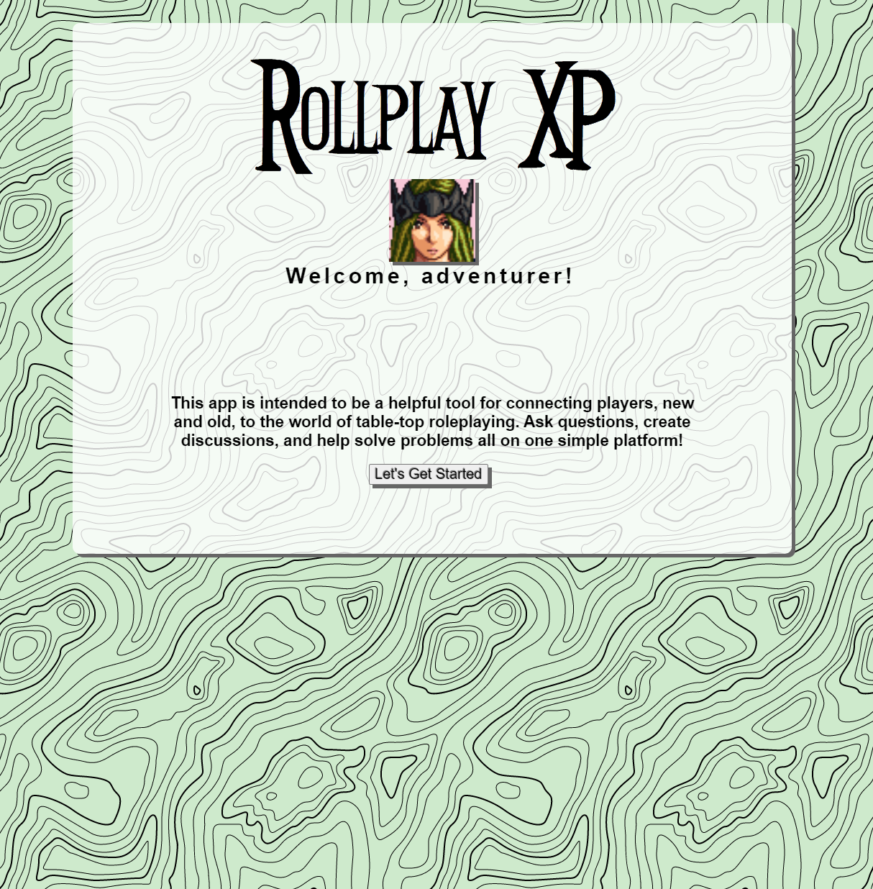
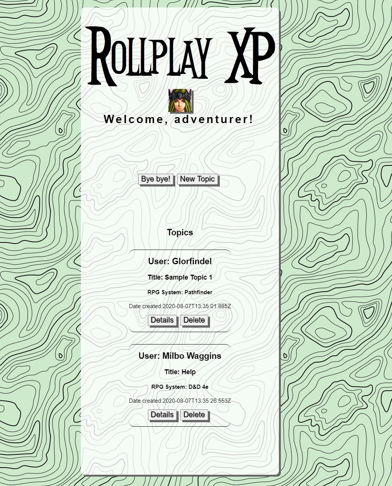
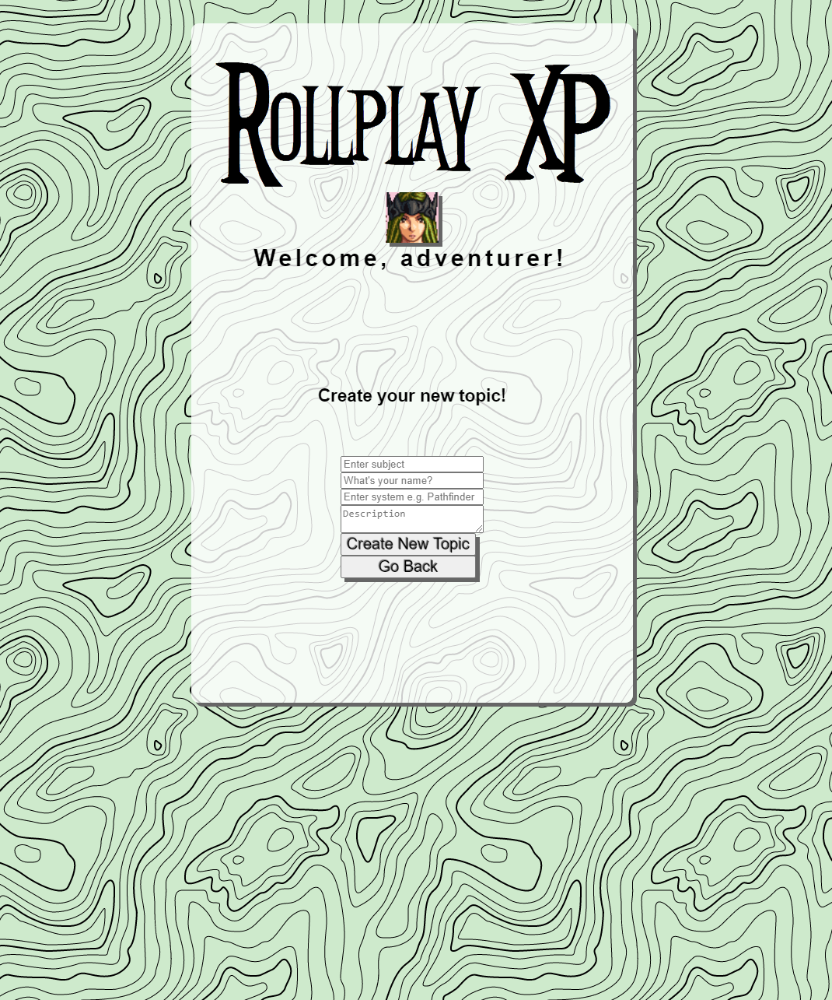
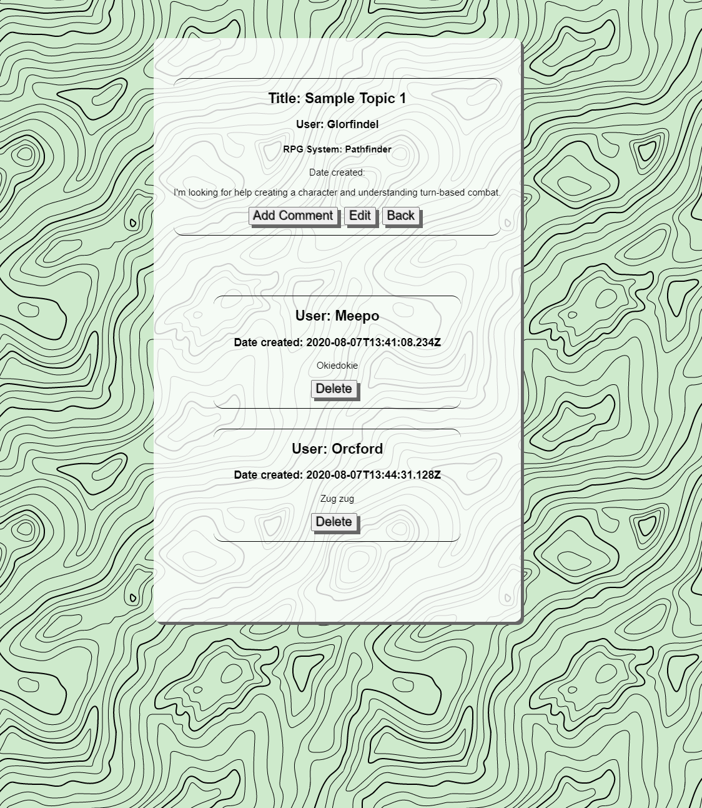
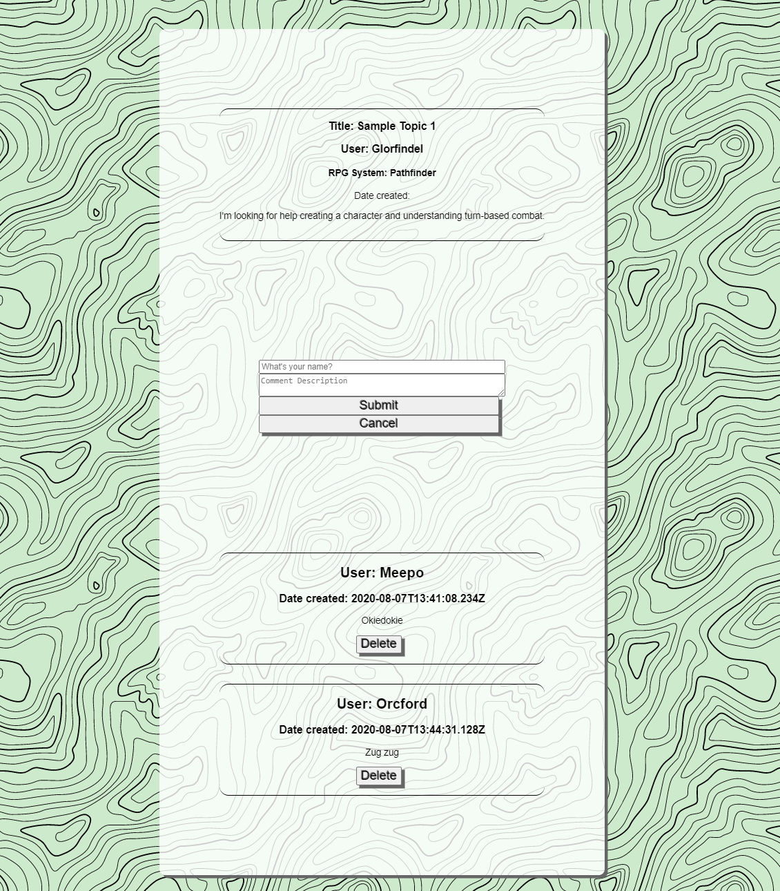

# Rollplay XP Server

Server used for the Rollplay XP app.

[Link](https://github.com/charmonica/chrissy-rollplay-client) to Github.

[Link](https://rollplay-client.vercel.app/) to Live Site

## Summary

Rollplay XP is a system for exchanging information between players of tabletop RPGs. One of the biggest impediments for new players is often the scale of the learning required for play, or difficulty in finding help in learning. Rollplay XP seeks to address that problem by introducing a system of topics and comments, allowing users to prompt discussions or ask questions and receive answers from their peers.

### Topics List

This is the first page encountered after passing the application's landing, a list of all currently active topics including the name entered by the user that created it, a title or summary, which RPG system the topic pertains to, and the date/time that the topic was created. It is also where, for the time being, new topics may be created and old topics deleted.

### Detailed Topic View

The next layer of Rollplay XP is the detailed view, expanding the description of a specified topic and listing the various replies and comments left by other users. The topics and comments may be edited on this page, and comments may also be added or deleted.

## Technology Used

- React
- Express
- CSS3
- Javascript
- Node
- PostgreSQL

## API Endpoints

+ `/topics/topics` accepts GET requests returning all entries in the rollplay_topics table, as  well as POST requests to add a new rows.

+ `/topics/:topic_id` accepts PATCH and DELETE requests, targeting rows by topic_id.

+ `/comments` accepts GET requests, returning all entries in the rollplay_comments table.

+ `/comments/:comment_id` accepts GET, POST, PATCH, and DELETE requests targeting rows of the rollplay_comments table by comment_id.

## Scripts

+ Start the application `npm start`

+ Start nodemon for the application `npm run dev`

+ Run the tests `npm test`

+ Migrate the Tables into database ` npm run migrate ` or ` npm run migrate:test `

+ Seed Tables with data after migration `npm run seed`
